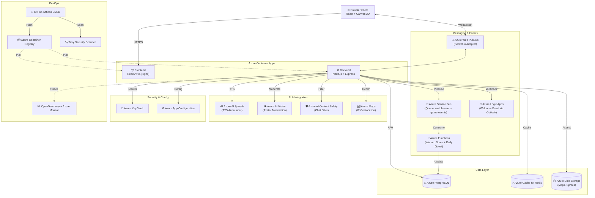

# ⚔️ ArenaBlast — Multiplayer 2D Real-Time Game

<div align="center">


**Dự án môn Điện toán đám mây (IN4526)**

🌐 **Live:** [https://arenablast-frontend.icyhill-22f427c6.southeastasia.azurecontainerapps.io](https://arenablast-frontend.icyhill-22f427c6.southeastasia.azurecontainerapps.io)

</div>

---

## 🎯 Ý tưởng & Mục tiêu

**ArenaBlast** là tựa game hành động 2D nhiều người chơi thời gian thực (Real-time Multiplayer) chạy hoàn toàn trên trình duyệt web — không cần cài phần mềm. Đây là bài toán lý tưởng để kiểm chứng và khai thác toàn diện hệ sinh thái **Microsoft Azure**, vì nó đặt ra những thách thức kỹ thuật đặc trưng của điện toán đám mây:

| Thách thức kỹ thuật | Giải pháp Cloud |
|:---|:---|
| **Low Latency** — độ trễ < 100ms cho mọi thao tác | Azure Web PubSub + Region Southeast Asia |
| **Scalability** — số người chơi tăng đột ngột | Azure Container Apps tự động Scale Replica |
| **Data Persistence** — lưu điểm, lịch sử bền vững | Azure PostgreSQL Flexible Server |
| **Real-time Sync** — đồng bộ nhiều Game Server | Azure Cache for Redis (Pub/Sub Adapter) |
| **Security** — không lộ thông tin nhạy cảm | Azure Key Vault + GitHub Secrets |
| **Observability** — theo dõi hệ thống sống | OpenTelemetry + Azure Monitor |

---

## 🎮 Tính năng nổi bật

- 🔐 **Xác thực đầy đủ:** Đăng ký / đăng nhập, tùy chỉnh Avatar & Vũ khí bằng hình ảnh
- 🏟️ **Chế độ chơi:** Tạo phòng riêng (mã phòng) hoặc Quick Match tự động ghép
- 🕹️ **Điều khiển:** `WASD` / mũi tên (Desktop) + Virtual Joystick (Mobile)
- ⚔️ **Chiến đấu:** Thu thập hạt vàng → nhân vật to hơn → tầm chém xa hơn → hạ gục đối thủ
- 📊 **Bảng xếp hạng:** Leaderboard cập nhật Real-time + Nhiệm vụ hàng ngày (Daily Quests)
- 🔊 **Announcer AI:** Giọng đọc thông báo chuỗi hạ gục (Double Kill, Rampage) bằng Azure AI Speech
- 🌍 **Geo Matching:** Tự động ghép phòng theo Quốc gia từ IP người chơi (Azure Maps)
- 🛡️ **Kiểm duyệt nội dung:** Tự động chặn Avatar phản cảm và tin nhắn chửi thề
- 📧 **Welcome Email:** Gửi email chào mừng tự động khi người chơi đăng ký

---

## 🏗️ Kiến trúc Hệ thống Cloud-Native

Dự án được thiết kế theo chuẩn **Microservices** + **Event-Driven Architecture**, triển khai hoàn toàn trên **Microsoft Azure — Region Southeast Asia**.



---

## ☁️ Nhà cung cấp & Hệ sinh thái Cloud (18 Dịch vụ)

**Nhà cung cấp:** Microsoft Azure — Subscription: *Azure for Students*
**Region:** Southeast Asia (Singapore) — tối ưu ping cho người dùng Việt Nam
**Resource Group:** `arenablast-rg`

| # | Nhóm | Dịch vụ Azure | Tên Resource | Mức độ phù hợp với bài toán |
|:---:|:---|:---|:---|:---|
| 1 | **Compute** | Azure Container Registry | `arenablastacr` | Lưu trữ Docker Images private cho Frontend & Backend |
| 2 | **Compute** | Azure Container Apps | `arenablast-frontend/backend` | Chạy container Serverless, auto-scale theo traffic game |
| 3 | **Database** | Azure PostgreSQL Flexible | `arenablast-db` | Lưu tài khoản, lịch sử đấu, bảng xếp hạng |
| 4 | **Cache** | Azure Cache for Redis Enterprise | `arenablast-redis-123` | Session cache + Pub/Sub adapter đồng bộ nhiều game node |
| 5 | **Messaging** | Azure Web PubSub | `arenablast-pubsub` | Scale hàng vạn WebSocket đồng thời, thay thế native WS |
| 6 | **Messaging** | Azure Service Bus | `arenablast-sb-729` | Message Queue xử lý kết thúc trận đấu bất đồng bộ |
| 7 | **Serverless** | Azure Functions | `arenablast-worker-99` | Worker tính điểm XP/Rank + Daily Quest ngầm |
| 8 | **Serverless** | Azure Logic Apps | `arenablast-logic` | Workflow gửi Welcome Email qua Outlook khi đăng ký |
| 9 | **Storage** | Azure Blob Storage | `arenablaststore13178` | Lưu file Map JSON, hình ảnh Sprite của game |
| 10 | **Security** | Azure Key Vault | `areablast-kv-123` | Quản lý tập trung tất cả Secrets & API Keys |
| 11 | **Config** | Azure App Configuration | `arenablast-appconfig-123` | Feature Flags & Game Settings thay đổi không restart |
| 12 | **AI** | Azure AI Speech | `arenablast-speech` | Text-to-Speech Announcer real-time (Double Kill, Rampage) |
| 13 | **AI** | Azure AI Vision (Computer Vision) | `arenablast-vision` | Kiểm duyệt Avatar: chặn ảnh Adult/Gory/Racy |
| 14 | **AI** | Azure AI Content Safety | `arenablast-contentsafety` | Lọc tin nhắn chửi thề, nội dung độc hại trong Chat |
| 15 | **AI** | Azure Maps | `arenablast-maps` | Geo IP → xác định Quốc gia người chơi để ghép phòng |
| 16 | **Observability** | Azure Monitor + App Insights | `workspace-arenablastrghGDX` | Thu thập Metrics, Traces, Logs theo chuẩn OpenTelemetry |
| 17 | **DevOps** | GitHub Actions (CI/CD) | `.github/workflows/ci.yml` | Pipeline tự động: Test → Build → Push → Deploy |
| 18 | **Security** | Trivy Security Scanner | CI/CD step | Quét lỗ hổng bảo mật Docker Image (Supply Chain Security) |

---

## 🔒 Bảo mật — Không Hardcode Secret/API Key

Dự án tuân thủ nghiêm ngặt nguyên tắc **Zero-Secret-In-Code**:

### 1. Luồng lấy Secret lúc Runtime
```
Container Apps khởi động
    → Backend gọi Azure Key Vault (Managed Identity / Client Secret)
    → Lấy về: DATABASE_URL, REDIS_PASSWORD, JWT_SECRET, SPEECH_KEY, VISION_KEY...
    → Gán vào process.env tại runtime
    → Ứng dụng kết nối thành công
```

### 2. Các lớp bảo vệ
| Lớp | Cơ chế | Vị trí |
|:---|:---|:---|
| **CI/CD Secrets** | `AZURE_CREDENTIALS` lưu trong GitHub Secrets | GitHub Repo → Settings → Secrets |
| **Runtime Secrets** | DB URL, API Keys lưu trong Azure Key Vault | `backend/src/config/env.js` fetch lúc khởi động |
| **Container Env** | Biến môi trường nạp qua Azure Container Apps | Không xuất hiện trong Dockerfile hay code |
| **Git Protection** | `.gitignore` loại `.env`, `*.key`, `secrets.*` | `.gitignore` |
| **HTTP Security** | `helmet.js` bảo vệ HTTP headers | `backend/src/app.js` |
| **Rate Limiting** | `express-rate-limit` chống DDoS | `backend/src/app.js` |

### 3. Kiểm chứng
```bash
# Tìm kiếm hardcoded secret trong toàn bộ source code
git grep -rn "password\s*=" --and --not "process.env" .
# → Kết quả: 0 matches (không có secret nào bị hardcode)
```

---


### Công cụ cộng tác
- **GitHub:** Quản lý code, Pull Request, Code Review, GitHub Projects (Kanban)
- **GitHub Actions:** Tự động test + deploy khi merge vào `main`
- **Azure Portal:** Theo dõi metrics, cấu hình dịch vụ

---

## 🔧 Tương tác và Kiểm tra trên Azure Portal

Hướng dẫn kiểm chứng hệ thống đang hoạt động thực tế:

```bash
# 1. Kiểm tra toàn bộ resource đang chạy
az resource list --resource-group arenablast-rg --output table

# 2. Xem logs thời gian thực của Backend
az containerapp logs show -n arenablast-backend -g arenablast-rg --follow

# 3. Kiểm tra health endpoint
curl https://arenablast-backend.icyhill-22f427c6.southeastasia.azurecontainerapps.io/health

# 4. Xem số kết nối Redis đang active
az redis show -n arenablast-redis-123 -g arenablast-rg --query "redisVersion"

# 5. Kiểm tra Function App đang chạy
az functionapp show -n arenablast-worker-99 -g arenablast-rg --query "state"
```

**Demo trực tiếp trong buổi báo cáo:**
1. Mở **Azure Portal** → `arenablast-rg` → quan sát CPU/Memory Container Apps nhảy khi có người chơi
2. Mở tab **F12 → Network → WS** → quan sát luồng WebSocket realtime
3. Đăng ký tài khoản mới → kiểm tra Email chào mừng từ Logic Apps
4. Thay đổi Feature Flag trên **App Configuration** → Game server tự cập nhật không cần restart
5. Xem **GitHub Actions** → pipeline tự chạy sau khi push code

---

## 📁 Cấu trúc Dự án

```
ArenaBlast/
├── .github/
│   └── workflows/ci.yml          ← GitHub Actions CI/CD Pipeline
├── frontend/                     ← React 18 + Vite + Canvas 2D
│   └── src/
│       ├── pages/GamePage.jsx    ← Game canvas chính
│       ├── hooks/useSocket.js    ← WebSocket client
│       └── api/speech.js         ← Azure AI Speech client
├── backend/                      ← Node.js + Express + Socket.IO
│   └── src/
│       ├── server.js             ← Entry point, kết nối Azure Web PubSub
│       ├── config/
│       │   ├── env.js            ← Load secrets từ Azure Key Vault
│       │   ├── appConfiguration.js ← Azure App Configuration
│       │   ├── serviceBus.js     ← Azure Service Bus client
│       │   └── redis.js          ← Azure Cache for Redis
│       ├── services/
│       │   ├── imageModeration.js   ← Azure AI Vision
│       │   ├── contentSafetyService.js ← Azure AI Content Safety
│       │   └── mapsService.js    ← Azure Maps Geo IP
│       ├── game/
│       │   ├── GameRoom.js       ← Game loop 30fps
│       │   └── GameManager.js    ← Quản lý phòng chơi
│       └── instrumentation.js    ← OpenTelemetry setup
├── worker/                       ← Azure Functions App
│   └── src/index.js              ← Service Bus triggers (Score + Daily Quest)
├── database/
│   ├── schema.sql                ← PostgreSQL schema
│   └── seed.js                   ← Dữ liệu mẫu
├── docs/                         ← Tài liệu từng giai đoạn
├── logic-app-def.json            ← Logic Apps workflow definition
└── docker-compose.yml            ← Dev local environment
```

---

## 🚀 Chạy Local (Development)

```bash
# Clone project
git clone https://github.com/Tienanh4869/CloudComputing_AreaBlastGame.git
cd CloudComputing_AreaBlastGame

# Copy file cấu hình mẫu
cp .env.example backend/.env

# Chạy toàn bộ stack với Docker Compose
docker-compose up --build

# Frontend: http://localhost:80
# Backend:  http://localhost:3001/health
```

---

## 🔗 Lộ trình Phát triển

| Giai đoạn | Mô tả | Tài liệu |
|:---|:---|:---|
| **Phase 1** | 🖥️ Chạy Local — Node.js + PostgreSQL thủ công | [docs/phase1-local.md](./docs/phase1-local.md) |
| **Phase 2** | 🐳 Docker Compose — Containerize toàn bộ stack | [docs/phase2-docker.md](./docs/phase2-docker.md) |
| **Phase 3** | ⚙️ GitHub Actions — CI/CD Pipeline tự động | [docs/phase3-github-cicd.md](./docs/phase3-github-cicd.md) |
| **Phase 4** | ☁️ Azure Cloud — 18 dịch vụ Production-ready | [docs/phase4-azure.md](./docs/phase4-azure.md) |

---

## 💰 Chi phí Dịch vụ Cloud

> SKU/Tier được truy vấn trực tiếp từ **Azure CLI** vào ngày 05/08/2026. Subscription: **Azure for Students** ($100 credit).

| # | Dịch vụ | Resource | SKU / Tier | Chi phí/Tháng |
|:---:|:---|:---|:---|:---:|
| 1 | **Azure Container Registry** | `arenablastacr` | Basic | ~$5.10 |
| 2 | **Azure Container Apps — Frontend** | `arenablast-frontend` | 0.5 vCPU / 1 GiB | ~$2–5 |
| 3 | **Azure Container Apps — Backend** | `arenablast-backend` | 0.5 vCPU / 1 GiB | ~$10–15 |
| 4 | **Azure PostgreSQL Flexible Server** | `arenablast-db` | Standard_B1ms / 128 GB | ~$20–25 |
| 5 | **Azure Cache for Redis Enterprise** | `arenablast-redis-123` | **Balanced B0** (HA + Zone Redundant) | ~$110 |
| 6 | **Azure Web PubSub** | `arenablast-pubsub` | **Standard S1** (1 unit) | ~$35.70 |
| 7 | **Azure Service Bus** | `arenablast-sb-729` | Basic | ~$0.10 |
| 8 | **Azure Functions** | `arenablast-worker-99` | Consumption (Free 1M calls) | **$0** |
| 9 | **Azure Logic Apps** | `arenablast-logic` | Consumption | **<$0.01** |
| 10 | **Azure Blob Storage** | `arenablaststore13178` | Standard LRS | **$0.05** |
| 11 | **Azure Key Vault** | `areablast-kv-123` | Standard (10k ops free) | **$0** |
| 12 | **Azure App Configuration** | `arenablast-appconfig-123` | **Free Tier** | **$0** |
| 13 | **Azure AI Speech** | `arenablast-speech` | **F0 Free** (5h TTS/tháng) | **$0** |
| 14 | **Azure AI Vision** | `arenablast-vision` | **F0 Free** (5k images/tháng) | **$0** |
| 15 | **Azure AI Content Safety** | `arenablast-contentsafety` | **F0 Free** (5k calls/tháng) | **$0** |
| 16 | **Azure Maps** | `arenablast-maps` | Standard G2 (10k tx free) | **$0** |
| 17 | **Azure Monitor / App Insights** | `workspace-arenablastrghGDX` | Log Analytics Free (5 GB) | **$0** |
| 18 | **GitHub Actions (CI/CD)** | Private Repo | Free 2,000 min/tháng | ~$0–4 |

### Tổng chi phí

| Danh mục | Chi phí/Tháng |
|:---|:---:|
| Compute (ACR + Container Apps × 2) | ~$17–25 |
| Database PostgreSQL B1ms / 128 GB | ~$20–25 |
| Redis Enterprise Balanced B0 | ~$110 |
| Web PubSub Standard S1 | ~$35.70 |
| Tất cả dịch vụ còn lại (Free Tier) | ~$0–4 |
| **TỔNG CỘNG** | **~$185–200/tháng** |
| Azure for Students Credit | **−$100** |
| **Chi phí thực trả** | **~$85–100/tháng** |

> **💡 Chiến lược tối ưu chi phí:** 10 trong số 18 dịch vụ được cấu hình **Free Tier / Consumption** — đây là ví dụ điển hình của **FinOps**: chỉ chi tiền cho những gì thực sự cần hiệu suất cao (Redis Enterprise cho Low Latency game, Web PubSub cho Scale WebSocket) và miễn phí hóa phần còn lại.

---

<div align="center">

*⚔️ ArenaBlast — Môn Điện toán đám mây (IN4526) — 2026*

**Microsoft Azure · GitHub Actions · Node.js · React · Socket.IO · PostgreSQL · Redis**

</div>
