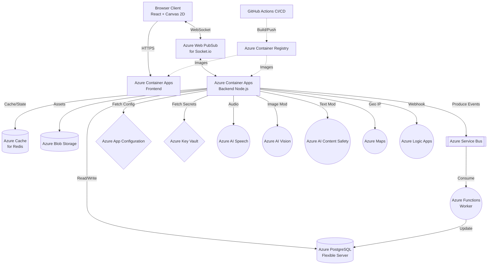

# ⚔️ ArenaBlast — Multiplayer 2D Real-Time Game

> **Dự án nghiên cứu môn Điện toán đám mây**  
> Game 2D multiplayer real-time sử dụng Node.js, React, Socket.IO, PostgreSQL, Redis, triển khai trên Microsoft Azure.

---

## 🗺️ Lộ trình triển khai

| Giai đoạn | Mô tả | Tài liệu |
|---|---|---|
| **Giai đoạn 1** | 🖥️ Chạy Local — Node.js + PostgreSQL thủ công | [📘 docs/phase1-local.md](./docs/phase1-local.md) |
| **Giai đoạn 2** | 🐳 Docker Compose — Đóng gói toàn bộ stack | [📘 docs/phase2-docker.md](./docs/phase2-docker.md) |
| **Giai đoạn 3** | ⚙️ GitHub & CI/CD — Tự động hóa pipeline | [📘 docs/phase3-github-cicd.md](./docs/phase3-github-cicd.md) |
| **Giai đoạn 4** | ☁️ Deploy Azure — Container Apps + PostgreSQL + Redis | [📘 docs/phase4-azure.md](./docs/phase4-azure.md) |

---

## 🎮 Giới thiệu

**ArenaBlast** là game 2D arena multiplayer real-time chạy hoàn toàn trên trình duyệt:
- Đăng ký / đăng nhập với nickname, **tùy chỉnh avatar & vũ khí bằng hình ảnh**
- Tạo hoặc tham gia phòng chơi bằng mã phòng
- Di chuyển `WASD` / `↑↓←→` (desktop) hoặc **Virtual Joystick** (mobile)
- Thu thập hạt vàng → điểm tăng → nhân vật **to hơn** → tầm chém **xa hơn**
- Tấn công đối thủ bằng `Space` — vũ khí có **animation vung chém**
- Hạ gục đối thủ → hạt của họ **rớt ra** để tranh nhau
- Xem leaderboard real-time và lịch sử trận đấu

---

## 🏗️ Kiến trúc Hệ thống Cloud-Native

Dự án được thiết kế theo chuẩn **Microservices** và **Event-Driven Architecture**, tận dụng triệt để hệ sinh thái của Microsoft Azure để đảm bảo khả năng mở rộng (Scalability), độ trễ thấp (Low Latency) và độ tin cậy cao (High Availability).



---

## 🚀 Bắt đầu nhanh

```bash
# Clone về
git clone https://github.com/YOUR_USERNAME/arenablast.git
cd arenablast

# Chạy với Docker Compose (cần Docker Desktop)
cp backend/.env.example .env
docker-compose up --build

# Mở trình duyệt
# Frontend: http://localhost:80
# Backend:  http://localhost:3001/health
```

---

## 📁 Cấu trúc thư mục

```
Game/
├── docs/
│   ├── phase1-local.md         ← Hướng dẫn chạy Local
│   ├── phase2-docker.md        ← Docker Compose
│   ├── phase3-github-cicd.md   ← GitHub & CI/CD
│   └── phase4-azure.md         ← Deploy Azure
├── frontend/                   ← React + Vite + Canvas 2D
├── backend/                    ← Node.js + Express + Socket.IO
│   └── src/game/               ← GameRoom.js, Physics.js, GameManager.js
├── database/
│   ├── schema.sql              ← PostgreSQL schema
│   └── seed.js                 ← Dữ liệu mẫu
├── worker/leaderboard-updater/ ← Azure Function
├── .github/workflows/ci.yml   ← GitHub Actions CI/CD
└── docker-compose.yml
```

---

## 🔑 Tài khoản Test

Sau khi chạy `node database/seed.js`:

| Username | Password | Role |
|---|---|---|
| demo | demo123 | player |
| player1 | player123 | player |
| admin | admin123 | admin |

---

## 🔗 API nhanh

| Endpoint | Mô tả |
|---|---|
| `GET /health` | Health check |
| `GET /metrics` | Basic metrics |
| `POST /api/auth/register` | Đăng ký |
| `POST /api/auth/login` | Đăng nhập |
| `GET /api/leaderboard` | Bảng xếp hạng |

Xem đầy đủ tại [docs/phase1-local.md#api](./docs/phase1-local.md).

---

## ☁️ Hệ sinh thái Cloud Services (18 Dịch vụ)

Dự án tự hào tích hợp toàn diện **18 dịch vụ đám mây và công nghệ Cloud-Native** theo chuẩn Enterprise:

| Nhóm | Dịch vụ Cloud | Vai trò trong hệ thống |
|:---|:---|:---|
| **Compute / PaaS** | **1. Azure Container Registry (ACR)** | Lưu trữ các Docker Images bảo mật trước khi triển khai. |
| | **2. Azure Container Apps (ACA)** | Chạy Frontend/Backend Serverless, tự động Scale linh hoạt. |
| **Database & Cache** | **3. Azure PostgreSQL** | Lưu trữ thông tin tài khoản, lịch sử đấu và bảng xếp hạng. |
| | **4. Azure Cache for Redis** | Caching dữ liệu và lưu trữ session tạm thời cực nhanh. |
| **Messaging & Events** | **5. Azure Web PubSub** | Xử lý hàng vạn kết nối Websocket đồng thời với độ trễ siêu thấp. |
| | **6. Azure Service Bus** | Message Broker nhận Event kết thúc trận đấu, gửi cho Worker xử lý ngầm. |
| | **7. Azure Functions** | Worker Serverless tính toán điểm XP/Rank mà không làm lag Game Server. |
| | **8. Azure Logic Apps** | Serverless Workflow gửi Email chào mừng người chơi mới qua Webhook. |
| **Storage & Security** | **9. Azure Blob Storage** | Lưu trữ Map, Asset đồ họa (Sprites) tĩnh. |
| | **10. Azure Key Vault** | Lưu trữ chuỗi kết nối DB, API Keys tuyệt đối an toàn. |
| | **11. Azure App Configuration** | Thay đổi thiết lập game (Feature flags) realtime không cần restart server. |
| **AI & Tích hợp** | **12. Azure AI Speech** | Đọc tên chuỗi hạ gục (Double Kill, Rampage) bằng giọng nói thời gian thực. |
| | **13. Azure AI Vision** | Quét và chặn người chơi tải lên Avatar phản cảm, bạo lực (Adult/Gory). |
| | **14. Azure AI Content Safety** | Tự động che mờ các tin nhắn chửi thề (Profanity) trong khung chat. |
| | **15. Azure Maps** | Phân tích IP người chơi ra Quốc gia (VN, US) để ghép phòng tối ưu ping. |
| **DevOps & MLOps** | **16. OpenTelemetry & Azure Monitor** | Đo lường độ trễ mạng (Latency), giám sát Metrics và Distributed Tracing. |
| | **17. GitHub Actions** | Pipeline CI/CD tự động Build, Test và Deploy lên Azure. |
| | **18. Trivy Scanner** | Quét lỗ hổng bảo mật Docker Image (Supply Chain Security) trước khi Push. |

---

*⚔️ ArenaBlast — Môn Điện toán đám mây — 2026*
